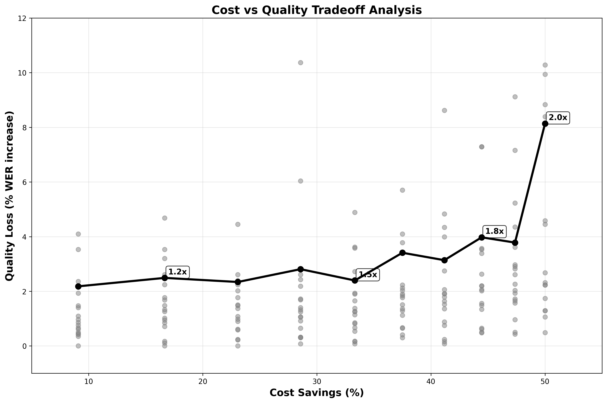

# Whisper Speed Optimization Analysis

A comprehensive analysis of OpenAI Whisper transcription quality vs audio speed tradeoffs. This project validates and extends [George Mandis's original research](https://george.mand.is/2025/06/openai-charges-by-the-minute-so-make-the-minutes-shorter/) with systematic experimentation.

## Quick Start

```bash
# Install dependencies
pip install -r requirements.txt

# Set up OpenAI API key
cp .env.example .env
# Edit .env and add your OPENAI_API_KEY

# Run complete analysis (uses existing data)
python analyze.py

# Collect new dataset (optional - requires API key)
python collect_data.py
```

## Results Summary

Our analysis reveals that audio can be sped up to **1.5x without major quality drawbacks**, offering significant cost savings for Whisper API usage.



The complete analysis shows speed-dependent tradeoffs across the full range from 1.0x to 2.0x.

## Repository Structure

```
whisper_speed_optimizer/
├── src/                           # Core modules
│   ├── speed_analyzer.py          # Main analysis logic
│   ├── visualizer.py              # Chart generation
│   ├── audio_preprocessor.py      # FFmpeg audio speed processing
│   ├── whisper_client.py          # OpenAI Whisper API interface
│   ├── quality_evaluator.py       # WER/CER metrics with header cleanup
│   ├── dataset_manager.py         # YouTube video downloading
│   ├── speed_optimizer.py         # Binary search optimization
│   └── data_processor.py          # Data processing utilities
├── baseline_1x_analysis/          # Experimental results
│   └── raw_video_analysis.json    # 209 experiments data
├── curated_videos.json           # YouTube video dataset
├── analyze.py                    # Main analysis script
├── collect_data.py              # Dataset collection script
├── requirements.txt             # Python dependencies
└── .env.example                # Environment variables template
```

## Key Findings

1. **1.5x speed is optimal** - Best balance of cost savings and quality
2. **Content-dependent results** - Educational content more speed-tolerant
3. **Quality cliff at 2.0x** - Sharp degradation beyond 2x speed
4. **Metadata contamination matters** - Headers in transcripts inflate WER scores
5. **0.1x increments reveal smooth curve** - No sharp quality drops until 2.0x

## Technical Details

### Analysis Data
- **Videos**: 19 educational YouTube videos (3Blue1Brown, Kurzgesagt, etc.)
- **Experiments**: 209 total (19 videos × 11 speeds each)
- **Speed Range**: 1.0x to 2.0x in 0.1x increments
- **Quality Metric**: Word Error Rate (WER) vs 1.0x baseline
- **API**: OpenAI Whisper-1 model ($0.006/minute)

### Audio Processing
- Uses FFmpeg `atempo` filter for pitch-preserving speed changes
- Handles speeds >2.0x by chaining multiple `atempo` filters
- Normalizes audio before processing

### Quality Evaluation
- Compares speed-adjusted transcriptions against 1.0x baseline
- Strips metadata headers that contaminate WER calculations
- Calculates both Word Error Rate (WER) and Character Error Rate (CER)

## Reproducing Results

The repository includes complete experimental data, so `python analyze.py` works immediately. To collect new data:

1. Add your OpenAI API key to `.env`
2. Run `python collect_data.py` (costs ~$15-20 for full dataset)
3. Results automatically saved to `baseline_1x_analysis/raw_video_analysis.json`

## Blog Post

Complete analysis and findings documented in: [Whisper's Hidden Optimization](https://alokbishoyi.com/blogposts/whisper-speed-optimization.html)
